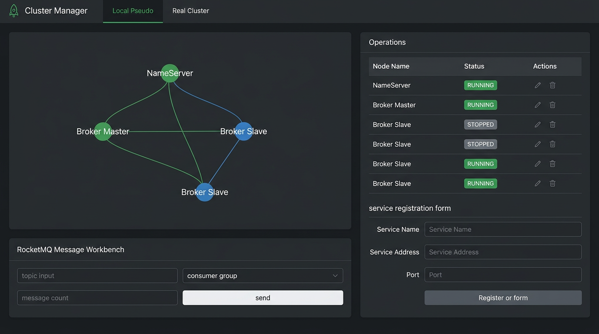

# MQCluster 集群管理控制台

[](https://github.com/JackLiKa/MQCluster/actions/workflows/ci.yml)
[](https://opensource.org/licenses/Apache-2.0)
[](https://openjdk.org/projects/jdk/17/)
[](https://nextjs.org/)
[](https://rocketmq.apache.org/)

统一管理本地伪集群、宿主 RocketMQ 节点与真实 RocketMQ 集群的 Spring Boot + Next.js 控制台。

MQCluster 将 `PSEUDO`（伪集群）与 `REAL`（真实集群）两种模式统一在一个 Web 界面中：你可以查看拓扑、启停节点、流式查看日志与监控、模拟消息收发，并登记真实服务与虚拟 TAP 节点进行混合联调。



> [English README](../../README.md) | [架构说明](../ARCHITECTURE.md) | [贡献指南](../CONTRIBUTING.md)

## 功能特性

- **统一的集群抽象** — 通过顶部导航在 `PSEUDO` 与 `REAL` 模式间切换。
- **RocketMQ 拓扑展示** — 使用 ECharts 可视化 NameServer、Broker Master、Broker Slave、Proxy。
- **节点生命周期管理** — 在运维面板中启动、停止、重启、删除服务。
- **手工服务登记** — 登记真实 IP / NameServer 或虚拟 IP，支持混合集群。
- **宿主 + 虚拟节点** — 伪集群模式下可同时接入本地 `HOST` 节点与 `VIRTUAL` TAP 节点。
- **消息工作台** — 模拟生产/消费流程；宿主节点可接入真实 RocketMQ 做收发验证。
- **实时遥测** — WebSocket 持续推送监控指标与日志。
- **单一可运行产物** — `mvn spring-boot:run` 会自动构建前端并托管 SPA。

## 快速开始

### 环境要求

- Java 17
- Node.js 20+ 与 npm
-（可选）本地 RocketMQ NameServer + Broker，用于宿主节点真实消息验证

### 开发模式运行

```powershell
# Windows
.\mvnw.cmd spring-boot:run

# macOS / Linux
./mvnw spring-boot:run
```

然后访问 `http://localhost:8088/`。

Maven 会自动编译 Next.js 前端并复制到 `target/classes/static`，因此完整 UI 直接通过后端端口访问。

### 前端热更新模式

```powershell
cd next
npm install
npm run dev
```

Next.js 开发服务器运行在 `http://localhost:3000`，并将 `/api`、`/ws`、`/guide` 代理到 `http://localhost:8088`。

### 构建并运行 JAR

```powershell
# Windows
.\mvnw.cmd clean package
java -jar target\mqcluster-0.1.0-SNAPSHOT.jar

# macOS / Linux
./mvnw clean package
java -jar target/mqcluster-0.1.0-SNAPSHOT.jar
```

## 配置说明

`src/main/resources/application.properties` 中的关键配置：

| 配置项 | 默认值 | 说明 |
| --- | --- | --- |
| `server.port` | `8088` | 后端与 SPA 的 HTTP 端口。 |
| `cluster.pseudo.cluster-id` | `local-lab` | 伪集群标识。 |
| `cluster.pseudo.cidr` | `10.77.0.0/24` | TAP 虚拟网络的 CIDR。 |
| `cluster.pseudo.auto-start` | `false` | 是否自动启动内置种子节点。 |
| `cluster.pseudo.work-dir` | `run/pseudo-cluster` | 伪节点运行时工作目录。 |
| `cluster.rocketmq.cluster-id` | `rocketmq-demo` | 真实集群视图标识。 |
| `cluster.rocketmq.name-servers` | `192.168.50.78:9876` | 宿主 RocketMQ 验证使用的 NameServer 列表。 |
| `cluster.stream.publish-interval-ms` | `5000` | 指标/日志 WebSocket 推送间隔。 |

## 架构设计

后端采用六边形架构：

- `core` — 领域模型与稳定端口（`IClusterProvider`、`IVirtualNetwork`、`IServiceRegistry` 等），不依赖外部框架。
- `application` — 通过 `ClusterProviderRegistry` 选择 provider，并由 `ClusterFacadeService` 编排用例。
- `infrastructure` — 伪集群与 RocketMQ 的具体适配实现。
- `api` — REST 控制器、DTO、WebSocket 配置与 SPA 转发。

详见 [docs/ARCHITECTURE.md](../ARCHITECTURE.md)。

## 测试

```powershell
# 后端测试
.\mvnw.cmd clean test

# 前端类型检查与构建
cd next
npm run build
```

## 参与贡献

欢迎提交贡献！请先阅读 [docs/CONTRIBUTING.md](../CONTRIBUTING.md) 了解分支命名、提交规范与 PR 流程。

## 安全

如发现安全漏洞，请按照 [docs/SECURITY.md](../SECURITY.md) 的说明私下报告。

## 许可证

MQCluster 基于 [Apache License 2.0](../../LICENSE) 开源。

## 致谢

- [Spring Boot](https://spring.io/projects/spring-boot)
- [Next.js](https://nextjs.org/)
- [Element Plus](https://element-plus.org/)
- [ECharts](https://echarts.apache.org/)
- [Apache RocketMQ](https://rocketmq.apache.org/)
